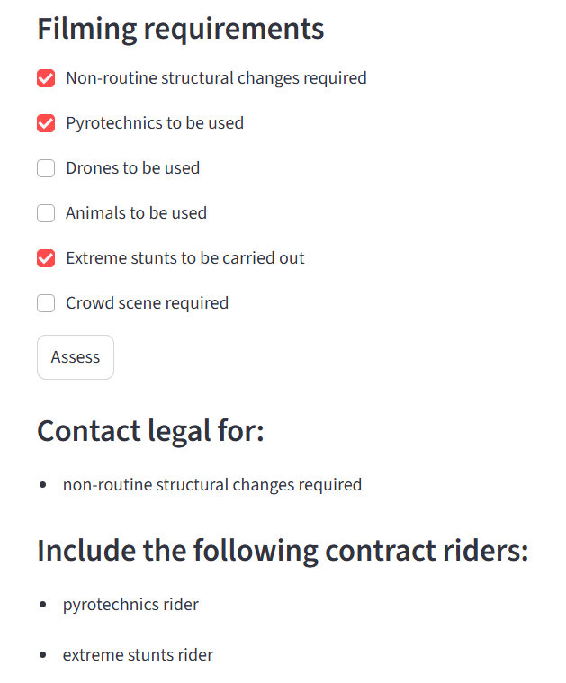

# Location agreement decision tool (Streamlit)
A brief checklist for location managers that models an internal decision tree for scripted film and TV location agreements.

## Project overview
This tool provides a structured assessment workflow whereby location managers input key information about a location, including its intended use during filming and any issues that might affect future rights (such as clearances). The output helps them to understand when the standard template location agreement can be used and when negotiations will need to be escalated to the legal team. The tool also helps location managers decide which issues relating to a location need to be flagged to colleagues in other teams.

## Features
- Streamlit UI for easy interaction (especially helpful for travelling location managers)
- Structured legal assessment logic contained in a standalone module (location_logic.py)
- Categorisation of legal, clearances, production management and contract riders triggers
- Clear output summarising required actions with reasoning
- Designed for expansion as needed (e.g. owner types, cross-border contracting logic)

## To run the app locally:
1. Install dependencies:
   ```bash
   pip install -r requirements.txt 

2. Run the Streamlit app:
   ```bash
   streamlit run app.py
   
3. App should open automatically in browser
   
   (If it does not, go to http://localhost:8501)

      
## Live demo
[Open the app on Streamlit Cloud](https://location-agreement-decision-tool.streamlit.app/)

## Repository structure
- 'app.py' - Streamlit interface
- 'location_logic.py' - legal assessment logic
- 'requirements.txt' - dependencies
- '/assets' - folder for screenshots and other assets
- 'README.md' - project documentation
- 'LICENSE' - project licence

## Example output
<p align="center">
   
</p>
<i> A sample section of the Streamlit UI, showing a portion of the input form and the resulting recommendations.</i>


## Future improvements
- Expand owner_type logic to cover actions required for checking title ownership, corporate standing and contracting with foreign parties
- Add country/jurisdiction-specific logic for international shoots (current assumption in this tool is that foreign locations are situated in same jurisdiction as principal filming, and will therefore be covered by location agreement templates drafted by legal in consultation with local counsel)
- Allow export to PDF or email summary

## Licence
This project is licensed under the MIT Licence. See the 'LICENSE' file for details.

## Disclaimer
This tool is a simplified demonstration for educational and portfolio purposes. It does not constitute legal advice and should not be relied upon for any purpose.
